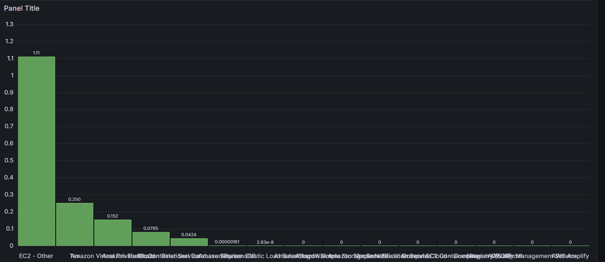

AWS Free Tier FinOps Dashboard
==============================

This project implements a FinOps dashboard to track AWS Free Tier usage costs. It uses Python for data processing, SQLite for storage, and Grafana for visual monitoring.

📁 Project Structure
--------------------

*   `data/usage.db` - SQLite database containing AWS service usage and cost data.
*   `init.py` - Initializes the database schema.
*   `fetch_data.py` - (Optional) Script to fetch and insert usage data into the database.
*   `grafana/` - Contains dashboard configuration and data source settings.

⚙️ Features
-----------

*   Tracks AWS services by usage and cost within Free Tier limits.
*   SQLite backend for lightweight data management.
*   Grafana dashboard with visualizations (bar/pie charts) of service-wise costs.

🚀 Setup Instructions
---------------------

1.  Clone the repository and navigate into the project directory.
2.  Run `init.py` to initialize the database:
    
        python init.py
    
3.  (Optional) Populate the database with sample or real usage data.
4.  Start Grafana and configure the SQLite data source pointing to `data/usage.db`.
5.  Create a new dashboard or import existing JSON, and visualize data using SQL queries:
    
        SELECT service, SUM(amount) AS cost FROM cost_data GROUP BY service ORDER BY cost DESC;
    

📊 Example Visualizations
-------------------------

*   Service-wise cost distribution using bar or pie charts
*   Trends over time (if usage\_date is included in queries)

*   

📝 License
----------

This project is licensed under the MIT License.
